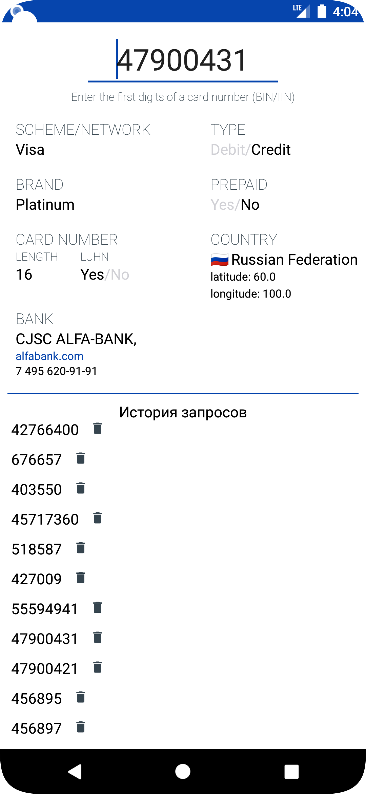

# BinListApp
## Возможности приложения:
*  после ввода BIN карты загрузка данных с сайта binlist.net и отображение их на экране;
*  отображение прогресс бара при загрузке данных;
*  при ошибке, при получении данных выводится Toast c сообщением;
*  вывод истории предыдущих запросов списком (recycleView);
*  история предыдущих запросов не теряется при перезапуске приложения(сохраняется в базу данных);
*  элемент истории предыдущих запросов возможно удалить, кликнув на значок корзины возле элемента;
*  нажатие на URL банка, телефон банка, координаты страны отправляет пользователя в приложение, которое может обработать эти данные (браузер, звонилка, карты).
## Используемые технологии:  
* Архитектурный паттерн - MVVM  
* База данных - Room. Преимущества данной библиотеки  
 1. Проверка SQL-запросов во время компиляции. Каждый @Query и @Entity проверяется во время компиляции.  
 2. Использование аннотаций для сокращения стандартного кода.  
 3. Так как является частью библиотеки Android Jetpack легко интенрируется с компонентами архитектуры, такими как LiveData, Flow, Coroutines.  
 * Rest клиент - Retrofit. Преимущества данной библиотеки
 1. Понятность и простота использования.
 2. Возможность добавления пользовательских заголовков и типов запроса.
 3. Легкая интеграция в приложение.
 4. Тратит мало ресурсов.
* Внедрение зависимостей (DI) - Dagger 2. Преимущества данной библиотек
 1. Гибкий инструмент дает много возможностей для DI
 2. Позволяет обнаружить ошибки во время компиляции, уменьшая количество ошибок в runtime
 ## Примечание:
 Добавил папку с последней версией apk приложения в корне проекта (APK)
 ## Cкриншоты
 
